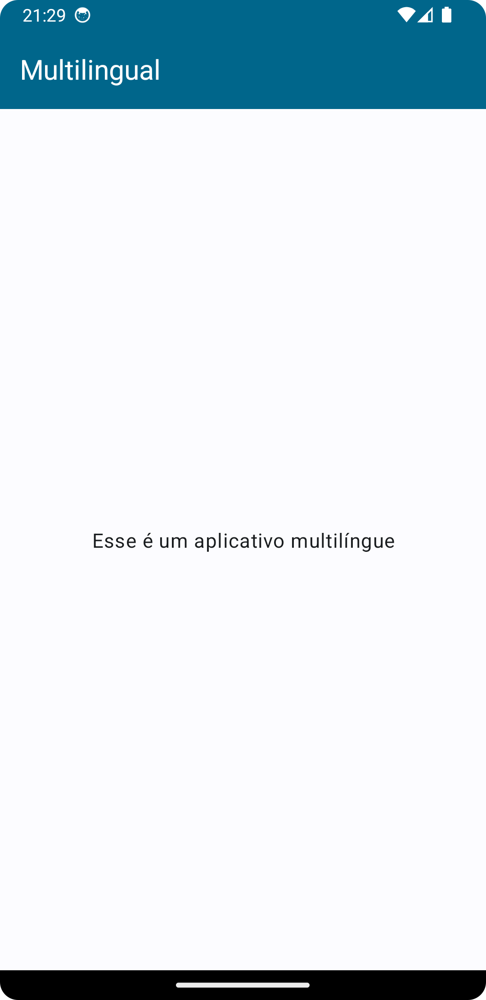
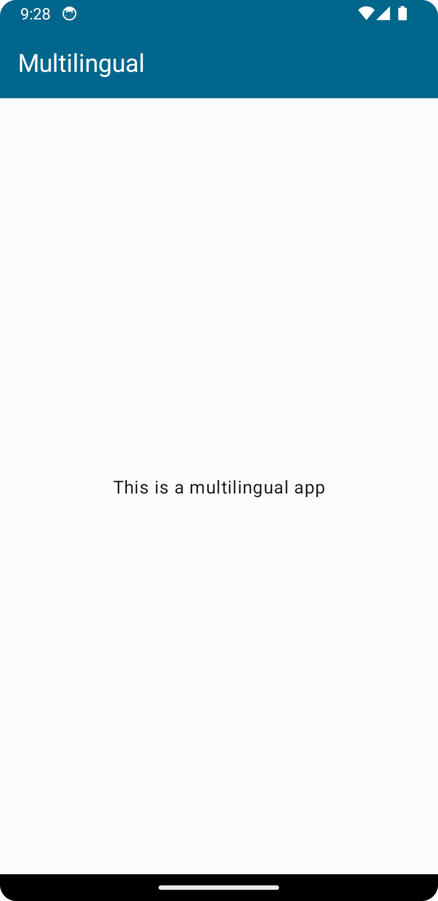
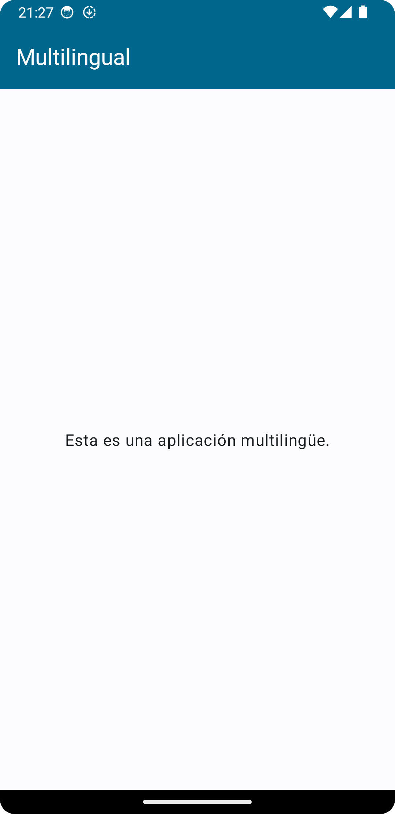

# Multilingual
> Esse projeto tem como objetivo representar como funciona um aplicativo com internalização de idiomas.

Telas com os idiomas Português (default), Inglês e Espanhol

|      |       |      |
| -------------------------------------------------------------------------------- | -------------------------------------------------------------------------------| ------------------------------------------------------------------------------|
| Português                                                                        | Inglês                                                                         | Espanhol                                                                       |
